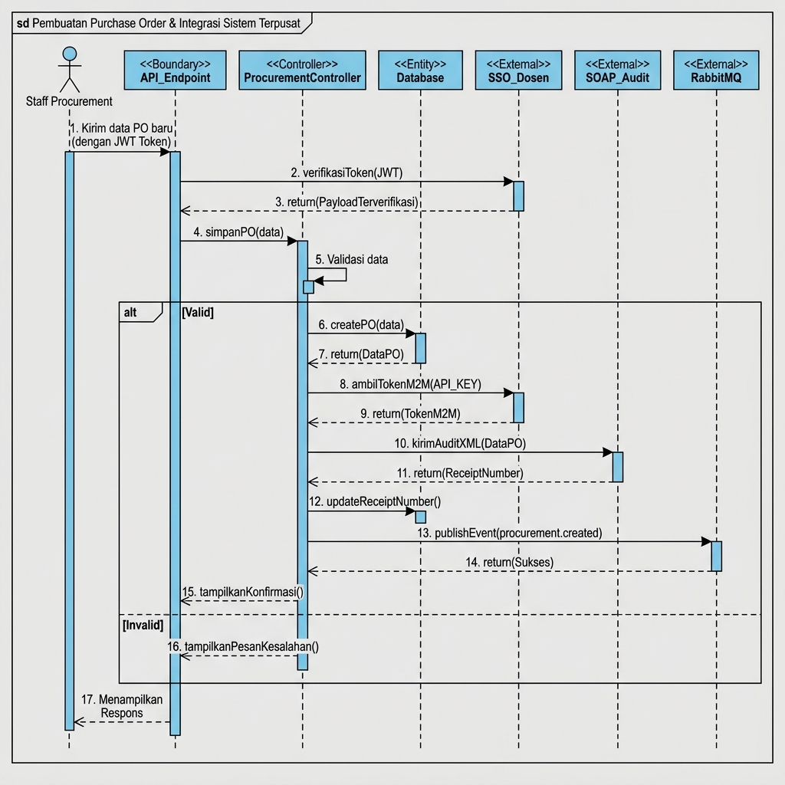

# Analisis Integrasi Layanan (Tugas 3)
**Service B – Procurement (Pengadaan Bahan Baku)**

**Nama: Raden Fatir Paundrayudha Airlangga Affandi**
**NIM: 102022430058**
**Kelas: SI-48-09**

## 1. Transaksi Kritis: Pembuatan Purchase Order (PO)

Dalam sistem kami, transaksi yang paling kritis adalah **Pembuatan Purchase Order Baru** yaitu saat staff procurement menekan tombol "Buat PO" dan sistem mengirimkan pesanan resmi ke supplier.

### Mengapa Transaksi Ini Sangat Penting?

Berikut alasan mengapa transaksi ini dinilai kritis:

1. **Melibatkan Uang dalam Jumlah Besar**
   Setiap PO berisi komitmen pembelian bahan baku yang nilainya bisa mencapai jutaan hingga ratusan juta rupiah. Kesalahan dalam pembuatan PO bisa menyebabkan kerugian finansial yang signifikan — misalnya memesan barang yang salah, jumlah berlebih, atau kepada supplier yang tidak tepat.

2. **Harus Tercatat di Sistem Pusat (Audit Trail)**
   Sama seperti setiap transaksi perbankan yang tercatat di Bank Indonesia, setiap PO yang dibuat juga **wajib dilaporkan ke sistem audit pusat** (yang dikelola oleh Dosen). Sistem ini menggunakan format lama (SOAP/XML), ibarat mengirim surat resmi dengan format baku yang tidak boleh diubah formatnya. Sebagai bukti bahwa laporan sudah diterima, sistem pusat akan memberikan **nomor resi (ReceiptNumber)**, mirip seperti nomor resi saat Anda mengirim surat tercatat di kantor pos.

3. **Harus Diketahui oleh Departemen Lain**
   Setelah PO dibuat, informasi ini perlu diketahui oleh departemen lain secara otomatis dan real-time:
   - **Departemen Logistik:** Perlu bersiap menjadwalkan pengiriman dari supplier.
   - **Departemen Gudang:** Perlu menyiapkan ruang penyimpanan untuk barang yang akan datang.
   - **Departemen Keuangan:** Perlu mencatat utang dagang yang akan jatuh tempo.

   Proses penyebaran informasi ini dilakukan melalui **RabbitMQ**, ibarat **sistem pengeras suara di bandara** yang mengumumkan informasi penerbangan ke semua gate, tanpa harus menelepon satu per satu.

## 2. Alur Integrasi dengan Sistem Terpusat

### Gambaran Umum

Saat seorang staff procurement membuat PO baru, ada **tiga sistem terpusat** yang dilibatkan:

| Sistem | Fungsi | Analogi |
|--------|--------|---------|
| **SSO Dosen** | Memverifikasi identitas pengguna | Seperti satpam yang memeriksa KTP sebelum masuk gedung |
| **SOAP Audit** | Mencatat transaksi secara resmi | Seperti notaris yang mencap dan mencatat dokumen resmi |
| **RabbitMQ** | Menyebarkan berita ke departemen lain | Seperti pengeras suara bandara yang menyiarkan pengumuman |

### Alur Step-by-Step

Berikut adalah penjelasan alur integrasi yang terjadi saat staff procurement membuat Purchase Order baru:

#### Fase 1: Pemeriksaan Identitas (Autentikasi SSO)

> **Analogi:** Seperti masuk ke kantor pemerintahan, yang dimana kita perlu menunjukkan KTP digital terlebih dahulu kepada satpam (SSO), dan satpam akan memverifikasi apakah KTP kita asli atau palsu.

1. Staff procurement mengirim permintaan pembuatan PO beserta **token JWT** (semacam KTP digital) yang didapat dari SSO Dosen.
2. Sistem kami mengirim token tersebut ke **SSO Dosen** untuk diverifikasi keasliannya menggunakan kunci publik (JWKS).
3. SSO Dosen membalas: *"Token ini asli, orangnya bernama Raden Fatir Paundrayudha Airlangga Affandi, perannya Warga."*
4. Sistem kami lalu mencatat/memperbarui data pengguna tersebut di database lokal dan mengizinkan permintaan dilanjutkan.

#### Fase 2: Penyimpanan Data PO (Logika Bisnis)

> **Analogi:** Seperti kasir yang memproses pesanan menghitung total, mencetak struk, dan menyimpan salinan di arsip toko.

5. Sistem memvalidasi kelengkapan data PO (nama supplier, tanggal, daftar barang, dll).
6. Jika valid, data PO beserta daftar item disimpan ke database lokal.
7. Sistem mendapatkan data PO lengkap yang sudah tersimpan, termasuk nomor PO otomatis (contoh: `PO-20260612-004`).

#### Fase 3: Pelaporan ke Sistem Audit (SOAP)

> **Analogi:** Seperti mengirim surat tercatat di kantor pos, dimana surat (data PO) harus dibungkus dengan amplop resmi berformat khusus (XML SOAP Envelope), kemudian dikirim ke alamat kantor pusat. Setelah diterima, kantor pusat memberikan **nomor resi** sebagai bukti bahwa laporan sudah tercatat.

8. Sistem meminta **token M2M** (Machine-to-Machine) dari SSO Dosen, ini seperti surat kuasa resmi yang membuktikan bahwa sistem kami berhak mengirim laporan atas nama pabrik.
9. SSO Dosen memberikan token M2M tersebut.
10. Sistem membungkus data PO ke dalam format **XML SOAP Envelope** yang kaku (format wajib dari sistem lama), lalu mengirimkannya ke endpoint `/soap/v1/audit`.
11. Sistem audit pusat membalas dengan **ReceiptNumber** (contoh: `IAE-LOG-2026-E61063A2`), ini adalah bukti resmi bahwa transaksi sudah tercatat.
12. Nomor resi ini kemudian disimpan ke database lokal di kolom `soap_receipt_number`.

#### Fase 4: Penyiaran Berita ke Departemen Lain (RabbitMQ)

> **Analogi:** Seperti menekan tombol *broadcast* di radio HT, sekali tekan, semua orang yang menyalakan radionya di frekuensi yang sama akan mendengar pengumuman tersebut. Bedanya, pengumuman ini dalam bentuk pesan digital (JSON) yang dikirim melalui *message broker*.

13. Sistem mengirimkan pesan berisi detail PO ke **RabbitMQ** melalui endpoint `/api/v1/messages/publish` dengan alamat tujuan `iae.central.exchange` dan label `procurement.created`.
14. RabbitMQ mengonfirmasi bahwa pesan sudah berhasil diterima dan akan diteruskan ke semua departemen yang berlangganan.

#### Fase 5: Respons ke Pengguna

15. Semua proses selesai, sistem mengirimkan respons sukses ke staff procurement, berisi data PO lengkap beserta nomor resi dari sistem audit.

## 3. Sequence Diagram Internal

Berikut adalah diagram urutan (Sequence Diagram) dalam format Visual Paradigm yang menggambarkan aliran interaksi Service B dengan semua sistem terpusat saat pembuatan Purchase Order:

### Penjelasan Komponen Diagram

| Komponen | Stereotype | Peran |
|----------|-----------|-------|
| **Staff Procurement** | Actor | Pengguna yang memulai proses pembuatan PO |
| **API_Endpoint** | `<<Boundary>>` | Pintu masuk sistem, menerima permintaan dan mengembalikan respons |
| **ProcurementController** | `<<Controller>>` | Otak sistem, mengatur alur logika bisnis dan koordinasi antar komponen |
| **Database** | `<<Entity>>` | Tempat penyimpanan data, menyimpan data PO dan nomor resi audit |
| **SSO_Dosen** | `<<External>>` | Sistem keamanan terpusat, memverifikasi identitas dan mengeluarkan token |
| **SOAP_Audit** | `<<External>>` | Sistem pencatatan resmi, menerima laporan dan memberikan nomor resi |
| **RabbitMQ** | `<<External>>` | Sistem penyiaran pesan, menyebarkan informasi ke departemen lain |

## 4. Pemetaan Peran (Role Mapping) dari SSO

Saat token JWT dari SSO diterima, sistem kami mengenali dua jenis "tamu":

### a. Pengguna Biasa (Warga)
> **Analogi:** Seperti tamu yang datang dengan KTP, kemudian kita catat namanya, emailnya, dan berikan akses sesuai perannya.

- Token bertipe `user` dengan profil lengkap (nama, email, NIM).
- Dipetakan ke peran lokal `warga` di tabel `roles`.
- Data pengguna disimpan/diperbarui di tabel `users`.

### b. Komunikasi Antar-Mesin (M2M)
> **Analogi:** Seperti kurir resmi dari kantor pusat yang membawa surat tugas, kita tidak perlu tahu siapa orangnya, yang penting surat tugasnya valid.

- Token bertipe `m2m` (Machine-to-Machine) tanpa profil personal.
- Dipetakan ke peran lokal `m2m` di tabel `roles`.
- Digunakan khusus untuk komunikasi sistem-ke-sistem (misalnya saat mengirim laporan SOAP atau pesan RabbitMQ).

## 5. Ringkasan Endpoint Krusial

Berikut adalah endpoint-endpoint penting yang terlibat dalam integrasi ini:

| No | Endpoint | Metode | Fungsi |
|----|----------|--------|--------|
| 1 | `/api/v1/procurements` | POST | Membuat Purchase Order baru (transaksi kritis utama) |
| 2 | `/api/v1/auth/token` | POST | Mendapatkan token M2M dari SSO Dosen |
| 3 | `/api/v1/auth/jwks` | GET | Mendapatkan kunci publik untuk verifikasi token |
| 4 | `/soap/v1/audit` | POST | Mengirim laporan audit dalam format XML ke sistem pusat |
| 5 | `/api/v1/messages/publish` | POST | Menyiarkan event ke RabbitMQ melalui HTTP Gateway |